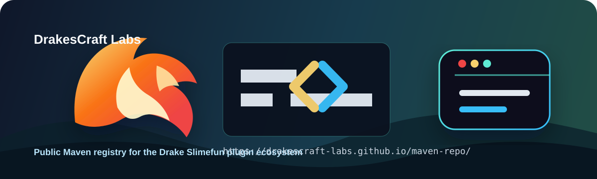

<p align="center">
  
</p>

# DrakesCraft Labs Maven Repository

Repositorio Maven publico para los artefactos Drake que usan los plugins de la organizacion **DrakesCraft Labs**.

La idea de este repo es simple: cualquier plugin separado de la organizacion debe poder compilar sin depender del reactor completo `drakes-slimefun-labs`, sin instalar jars a mano y sin confiar en la cache Maven de una maquina especifica.

## Usage En Plugins

Agrega este repositorio en el `pom.xml` del plugin:

```xml
<repositories>
  <repository>
    <id>drakescraft-labs-maven</id>
    <url>https://drakescraft-labs.github.io/maven-repo/</url>
    <releases>
      <enabled>true</enabled>
    </releases>
    <snapshots>
      <enabled>true</enabled>
    </snapshots>
  </repository>
</repositories>
```

En Gradle se usa el mismo repositorio Maven:

```kotlin
repositories {
    maven {
        name = "drakescraftLabs"
        url = uri("https://drakescraft-labs.github.io/maven-repo/")
        mavenContent {
            includeGroup("com.github.drakescraft_labs")
        }
    }
}
```

Luego declara las dependencias Drake que correspondan:

```xml
<dependency>
  <groupId>com.github.drakescraft_labs</groupId>
  <artifactId>slimefun-core</artifactId>
  <version>11.0-Drake-1.21.1-SNAPSHOT</version>
  <scope>provided</scope>
</dependency>
```

## Artefactos Publicados

| Artifact | Version | Uso principal |
| --- | --- | --- |
| `com.github.drakescraft_labs:slimefun-core` | `11.0-Drake-1.21.1-SNAPSHOT` | Core Drake/Slimefun usado como API base por los addons |
| `com.github.drakescraft_labs:dough-core` | `1.3.1-DRAKE-v11-SNAPSHOT` | Utilidades compartidas requeridas por plugins portados |
| `com.github.drakescraft_labs:sefilib-drake` | `0.3.1-DRAKE-SNAPSHOT` | Libreria auxiliar usada por Networks y otros addons |
| `com.github.drakescraft_labs:InfinityExpansion-drake` | `1.20.6-Drake-SNAPSHOT` | API/compatibilidad de InfinityExpansion para integraciones |
| `com.github.drakescraft_labs:NetworksV6-drake` | `11-SNAPSHOT` | Jar compilado de NetworksV6 Drake como primer plugin independiente controlado |
| `com.github.drakescraft_labs:Networks-Experimental-drake` | `11-SNAPSHOT` | Jar experimental compilado de Networks con características avanzadas |

## Politica De Uso

- Este repo es para dependencias compartidas, no para publicar cada jar final de plugin jugable.
- Los plugins de la org deben apuntar aqui cuando dependan de artefactos Drake internos.
- Los POMs publicados deben mantenerse lo mas independientes posible para no arrastrar parents locales ni rutas del reactor.
- Si un plugin necesita una dependencia interna nueva, primero se publica aqui y despues se actualiza el `pom.xml` del plugin.

## Publicacion Controlada

Los scripts de `scripts/` permiten publicar artefactos desde el monorepo o desde repos independientes:

```powershell
.\scripts\Publish-DrakeManifest.ps1 -ManifestPath .\catalog\drake-artifacts.json
```

Para generar un catalogo inicial de jars detectados:

```powershell
.\scripts\New-DrakeArtifactCatalog.ps1
```

Ese catalogo se revisa antes de publicar; no conviene subir automaticamente cualquier jar sin confirmar version, nombre y uso.

## Smoke Test Recomendado

Para verificar que un plugin realmente compila sin cache local:

```powershell
$tempRepo = Join-Path $env:TEMP ('drake-m2-clean-' + [Guid]::NewGuid().ToString('N'))
New-Item -ItemType Directory -Path $tempRepo | Out-Null
mvn "-Dmaven.repo.local=$tempRepo" -U -DskipTests package
```

Si eso termina con `BUILD SUCCESS`, el plugin ya no depende del entorno local de un desarrollador.

## Repositorio

- GitHub: <https://github.com/DrakesCraft-Labs/maven-repo>
- Maven URL: <https://drakescraft-labs.github.io/maven-repo/>
- Landing: <https://drakescraft-labs.github.io/maven-repo/index.html>
- Gradle: [docs/USAGE_GRADLE.md](docs/USAGE_GRADLE.md)
- Publicacion: [docs/PUBLISHING.md](docs/PUBLISHING.md)
